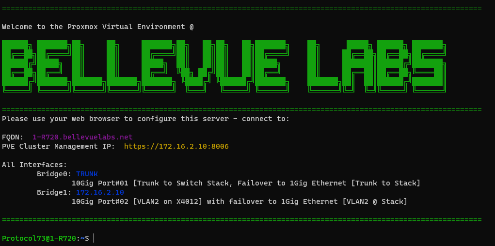
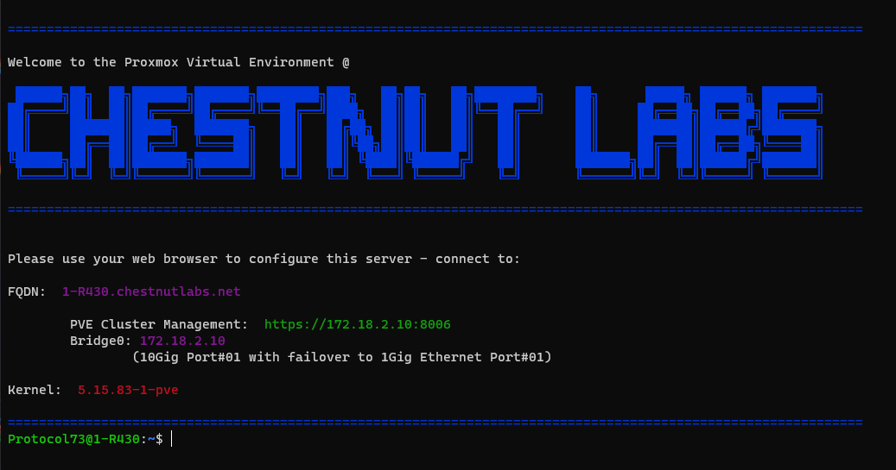

## Proxmox Pretty Login Notes.md

### Intro:

What if you wanted more the the basic login banner Proxmox ships with?   
Colors and cool ASCII Block lettering, Sounds cool right? 

If you follow this guide, you should end up with something like this:  

The full code for the above image is in this repository as: ```pvebanner-BL-Example01```

### TO DO  
+ /etc/motd (After Login) [Not Documented here yet.]
+ Make suggestions, or open issues for me to add more things here!

## NEEDED:
+ SSH access
+ Text editor (vim,nano,etc.)
+ Basic understanding of config/script files
+ sudo or root access (I used sudo, only needed sudo su once) 


#### Lets start with some file locations and basics,  

```
/etc/motd
/etc/issue
/usr/bin/pvebanner
```

*MOTD* -- Proxmox Message of the day. **Still on the to do list**  
	Far as I am aware you can just change this with your favorite text editor.  
	This gets printed to your screen/terminal after login.  
	Have fun, make it cool, or make it Corporate generic:   
 - ================================  
 - === "Unauthorized access is prohibited..." ==
 - ================================  
 
The choice is yours, I'll provide [a few examples] you can look at for ideas later. [TO DO]()  

Next is the login banner via the issue file.  
Proxmox generates this file via a [Perl script](https://forum.proxmox.com/threads/etc-issue-edits.54964/)  
And the pvebanner service/command. (No docs for it, really.)  
If you write directly to the issue file,  
the next time the service runs it will get overwritten. (at reboot)

To print your current issue file to the terminal:  
``` sudo getty --show-issue ```  

As the issue file is still displayed to the system using [getty](https://manpages.debian.org/bullseye/util-linux/agetty.8.en.html),  
you can also use escape codes to display system info.  

Here is the ones I am using:  
	Note: I had never written any Perl before this project. :-)

```
\4{vmbr0} #Print IPv4 address of {Interface}.
\4{vmbr1} #Added for servers with mutiple {interfaces}.
\ec #clear the terminal
\n.\O #What it says on the tin
\m # Same as 'uname -m'
\r #PVE Kernel Version
```

Also there is a:  
``` 
	my $xline = '-' x 78;
```
That Prints the top & bottom bars, We'll come back to that.

### Ready to Make Changes? 

Now before we change the banner file lets make a copy of the original  

**NOTE: I am running as a user with sudo;**

Make a copy of the original as: pvebanner.bak0  

``` sudo cp /usr/bin/pvebanner /usr/bin/pvebanner.bak0 ```

I name copies of original files as .bak0 {Backup 0}  
That way if I want to restore or save another version of the file I can just Increment.  
And restoring to the original with this process is as simple as:  
``` 
cp \file\original\path.bak0 \file\original\path
```  
Makes me a little more willing to break things :-)  

Now, I want colors in my output so,
I'll also be using [ANSI escape codes](https://en.wikipedia.org/wiki/ANSI_escape_code)  
More info if you want to get crazy with it.  

+ [Flogsoft - Colors & Formatting ](https://misc.flogisoft.com/bash/tip_colors_and_formatting)
+ [Stack Overflow](https://stackoverflow.com/questions/5947742/how-to-change-the-output-color-of-echo-in-linux#5947802)

Alright, lets open the script and start making it pretty!
```
sudo nano /usr/bin/pvebanner
```


There is a more then one way to add escape codes to texts file  
In this case, the easiest is using '\e'

```
\e[39m Default
\e[31m Red
\e[32m Green
\e[33m Yellow
\e[34m Blue
\e[35m Magenta
\e[36m Cyan
\e[37m Light gray

\e[0m  Clear/Reset
```

For Testing how it will look, you can add this above:   
```
$xline

__EOBANNER

}
```

Now Save your changes (Ctrl + S) and exit nano (Ctrl + X)

Run the script to update the /etc/issue file: ```sudo pvebanner ```

Check your new output: ```sudo getty --show-issue ```
Or you can just: ``` cat /etc/issue ```

I recommend that you check how it looks via anyway the server will be accessed. (via CLI)

In my case that is: 
+ KVM @ the Server Rack
+ SSH via network (Win & OSX)
+ Web console (only for /etc/motd)

I liked the look of an ASCII Banner, so I used [Patorjk.com](http://patorjk.com/software/taag/#p=display&f=ANSI%20Shadow&t=Proxmox)  
"ANSI shadow" works for the look I want, but there is plenty of options.  

Now as I like my code to be legible to my future myself and those after me:   
I added this towards the top of the file:  

```
my $ipbridge0 = '\4{vmbr0}'; #Print IPv4 address of {Interface}.
my $ipbridge1 = '\4{vmbr1}'; #Added for servers with mutiple {interfaces}.
my $clearterm = '\ec'; #clear the terminal
my $fqdn = '\n.\O'; #What it says on the tin
my $architecture = '\m'; # Same as 'uname -m'
my $Kernel = '\r'; #PVE Kernel Version
```

Back to that: ``` $xline ``` line...

I changed it to: ``` my $xline = '\e[32m=\e[0m' x 110; ```  
This Changes the color to green, the item printed to " = "  and the times if is printed to: 110   

Then I added my banner as:
```
my $BLbanner ='\e[32m
  
  **Banner ASCII Text Here**
  
\e[0m';
```

Then in-between: ```<<__EOBANNER;``` &  ```__EOBANNER```  

I setup my banner 
+ *See the example files if you are not sure how it's setup*  
+ Don't put anything you want in the banner on the same line as the EOBANNER lines

Toss it all together and you should end up with something like this:  
The full code for the below image is in this repository as: ```pvebanner-BL-Example01```


Example 02 File:  
```pvebanner-CL-Example02 ```




### Displaying /etc/issue to SSH

Once you are pleased how ```/etc/issue``` looks  
We can copy it to be used for ssh as well!  

Note: You could try and use the /etc/issue file but I find that most of the time,  
your better off having a separate file, as this one will not be read by *getty*

Now to copy the pretty output to the new file:  

Run last check: ```sudo getty  --show-issue ```

Looks good? Then lets create: ```/etc/issue-ssh ```  
+ Now, most ssh clients don't support color escape characters.
+ But support for 'clear' works on most I've tested.

Note: Might need to run this as root  
+ Create file and put the "clear" escape Sequence in the file:  
```clear > /etc/issue-ssh```

Now open in editor: ```sudo nano /etc/issue-ssh```  
You should see the escape code as the fist line of the file like this: ```^[[H^[[2J^[[3J ```

Paste in your text from the getty out output (as plain text) and save.
+ Test that the terminal is cleared & the desired output is produced:
+ ```cat /etc/issue-ssh```

The Final steps to get this working for ssh, you will need to edit this config:  
	 ```/etc/ssh/sshd_config```

In that file towards the bottom you'll see:  
```
# no default banner path
#Banner none
```

Change it to the following:
```
#Cool Banner path
Banner /etc/issue-ssh
```

Then restart the sshd service for the config file to be reloaded.  
```sudo service sshd restart ```  
+ I did this via ssh as a am a crazy person (without any issues)  
+ But had iDRAC & physical access to the server in case anything went wrong.  
+ Don't push your luck if you don't have to.   

The service restart can be done via:  
+ Web GUI: Node > System > sshd > restart  
+ At the server: sudo service sshd restart  
+ via KVM, ipmi cimc, idrac, ilo etc.  

Once the sshd service has restated you should get the banner on next login!  
If not check if the sshd service has any errors: ```sudo service sshd status```


That's it!  
Let me know if you have any suggestions or issues!  
#### Protocol73